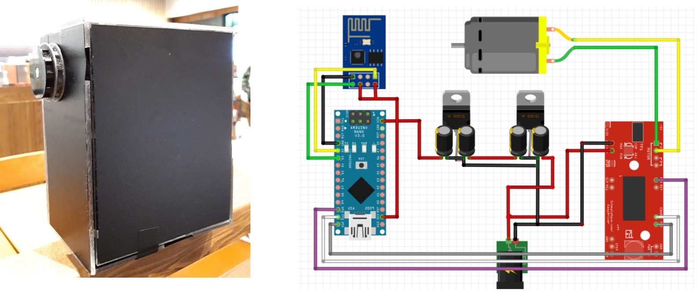

# Smart_Blind
> 학부생 2학년 2학기 때 개발한 스마트 블라인드 컨트롤러

## 개발기간
* 2018.08.30.~2018.12.14. (약3개월)

## 주요 기능
* 블라인드의 줄에 걸어 원격으로 제어하는 스마트 블라인드 컨트롤러를 개발함
* 시중의 제품을 분석하여 그대로 재현해봄
    * 3D프린팅을 통해 블라인드 줄에 맞는 부품 제작
* 상세 내용은 링크 참조
<https://drive.google.com/file/d/1KvASIRGkFxsoFC3eV4Te94_ApoIsbMvy/view?usp=sharing>

## Release History

* 1.0.0
    * first
    * 개발 완료

## Contact

김준혁 – kimjunhyeok.it@gmail.com
