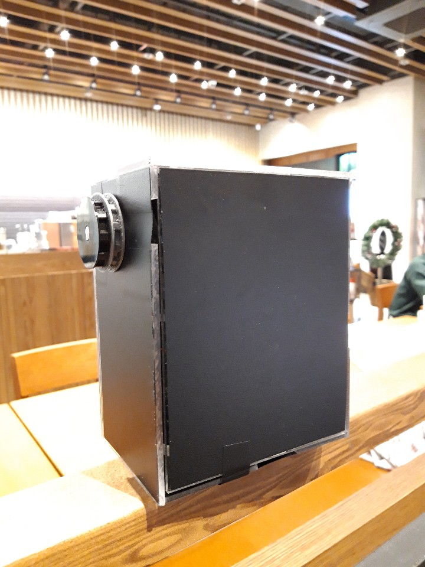
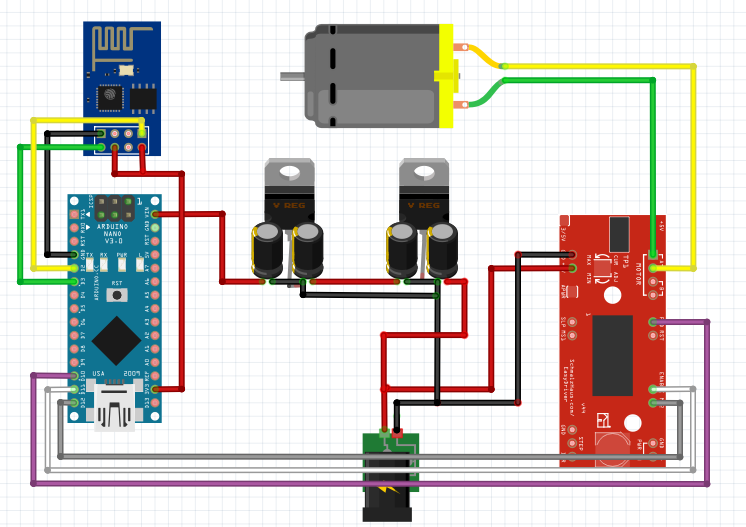

# Smart_Blind
> 학부생 2학년 2학기 때 개발한 스마트 블라인드 컨트롤러

## Installation

-

## Usage example

DC 24V 기어드 모터를 사용하여 블라인드 줄에 걸고 웹을 통해 블라인드를 제어함

## Development setup

IDE: Arduino

## Release History

* 1.0.0
    * first
    * 개발 완료

## Meta

김준혁 – wnsgur1198@naver.com

## Contributing

1. Fork it (<https://github.com/yourname/yourproject/fork>)
2. Create your feature branch (`git checkout -b feature/fooBar`)
3. Commit your changes (`git commit -am 'Add some fooBar'`)
4. Push to the branch (`git push origin feature/fooBar`)
5. Create a new Pull Request

<!-- Markdown link & img dfn's -->
